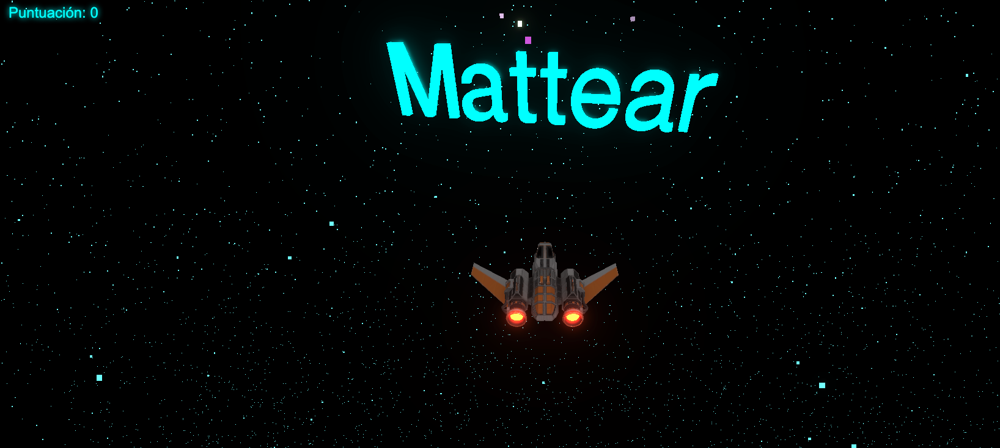

# 🚀 Mattear - Space Shooter 3D


Un juego de disparos espacial estilo arcade desarrollado con **Three.js** y **TypeScript**, utilizando **Vite** como entorno de desarrollo. El proyecto cuenta con efectos de post-procesado (Bloom/Neón), gestión de partículas y cargas de modelos 3D asíncronas.



### 🕹️ [¡JUGAR AHORA (LIVE DEMO)!](https://mattear-com.github.io/example_threejs/) 👈


## ✨ Características

* **Motor 3D:** Renderizado performante utilizando WebGL a través de Three.js.
* **Efectos Visuales:** Implementación de `UnrealBloomPass` para un efecto de brillo "Neón" en títulos y proyectiles.
* **Campo de Estrellas Dinámico:** Sistema de partículas personalizado (`BufferGeometry`) que simula velocidad warp.
* **Físicas Arcade:** Detección de colisiones mediante `Box3` (AABB) para naves, proyectiles y objetivos.
* **Modelos 3D:** Carga de modelos externos (`.glb`) y fuentes 3D (`TextGeometry`).
* **Interfaz de Usuario (UI):** Menú de inicio, puntuación en tiempo real y pantalla de Game Over integrados en el DOM.

## 🎮 Controles

| Tecla | Acción |
| :--- | :--- |
| **↑ Flecha Arriba** | Avanzar (Mover hacia adelante) |
| **↓ Flecha Abajo** | Retroceder (Frenar/Ir hacia atrás) |
| **← Flecha Izquierda** | Rotar a la izquierda |
| **→ Flecha Derecha** | Rotar a la derecha |
| **Barra Espaciadora** | Disparar láser |

## 🛠️ Instalación y Uso

Sigue estos pasos para ejecutar el proyecto localmente:

1.  **Clonar el repositorio:**
    ```bash
    git clone [https://github.com/tu-usuario/mattear-space-shooter.git](https://github.com/tu-usuario/mattear-space-shooter.git)
    cd mattear-space-shooter
    ```

2.  **Instalar dependencias:**
    ```bash
    npm install
    ```

3.  **Iniciar el servidor de desarrollo:**
    ```bash
    npm run dev
    ```

4.  **Abrir en el navegador:**
    Visita la URL que muestra la terminal (usualmente `http://localhost:5173`).

## 📂 Estructura del Proyecto

El código principal se encuentra en `src/main.ts` y está organizado bajo un paradigma de Programación Orientada a Objetos:

* **`App`**: Clase principal que orquesta el ciclo de renderizado (loop), la escena, la cámara y los inputs.
* **`Spaceship`**: Lógica de movimiento y estado de la nave del jugador.
* **`Projectile`**: Gestión de disparos, velocidad y tiempo de vida.
* **`Target`**: Generación y rotación de los enemigos (cubos).
* **`Starfield`**: Generación procedural del fondo estelar.

## 📦 Assets Requeridos

Para que el proyecto funcione correctamente, asegúrate de tener los siguientes archivos en tu carpeta `/public`:

* `spaceship.glb`: El modelo 3D de la nave.
* `helvetiker_regular.typeface.json`: La fuente para el título 3D.

## 🚀 Build para Producción

Para generar los archivos optimizados para subir a un hosting (Vercel, Netlify, GitHub Pages):

```bash
npm run build
```
